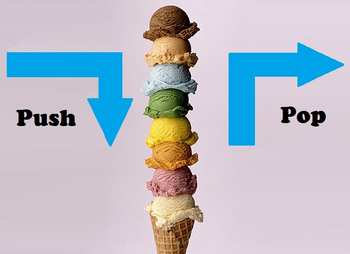

# Stack

* [Introduction - What is a Stack?](#introduction)
    * Ice Cream cone Example
    * Flow of data
* [When to use a stack?](#when-to-use-a-stack)
    * Front
    * Back 
* [Elements of stacks](#elements-of-a-stack)
    * Push 
    * Pop
    * Size
    * Empty
* [Performance](#preformance) 
* [Example](#example)
* [Try it out!](#try-it-out)

## Introduction
Now as we look at this image what comes to mind? You may be thinking "Wow someone loves ice cream" or maybe "Lactose nightmare!" but for the sake of this lesson lets think of how the ice cream is **stacked** 

When you create an ice cream tower like this, it all starts at the bottom and you work your way up. Stacks work in a similar manner. It works in the manner of **Fisrt** in **Last** out. 

## When to use a Stack
Stacks are really

## Elements of a Stack

|Operation   |Description                                            |Python Code                   |Preformance|
|------------|-------------------------------------------------------|------------------------------|-----------|
|push("item")|Adds a "item" to the back of the stack                 |icecream.append(flavor)       |O(1)       |
|pop()       |Removes and returns the item from the back of the stack|nextFlavor = icecream.pop()   |O(1)       |
|size()      |Return the size of the stack                           |numFlavors = length(icecream) |O(1)       |
|empty()     |Returns true if the length of the stack is empty       |if len(icecream) == 0         |O(1)       | 

## Preformance

As we can see the preformance for all the operations of a stack including adding or removing to a dynamic array, returning the size and checking the size are all the preformance of O(1). The reason that this is the case is because stacks always opperate on the back of the dynamic array.  

## Example 

## Try it out!

[Overview](../README.md) | [Next Lesson](../3-LinkedList/LinkedList.md)