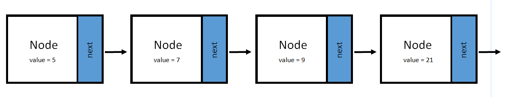
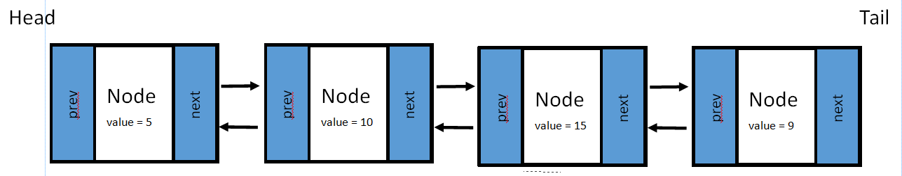
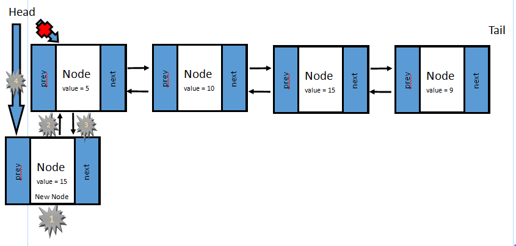
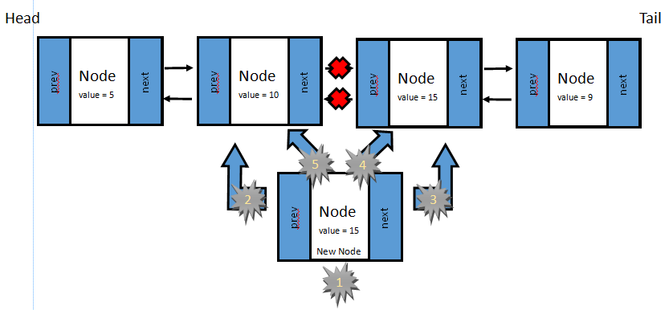
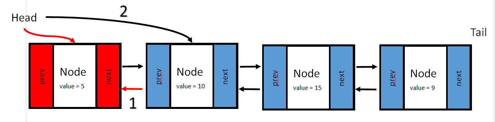
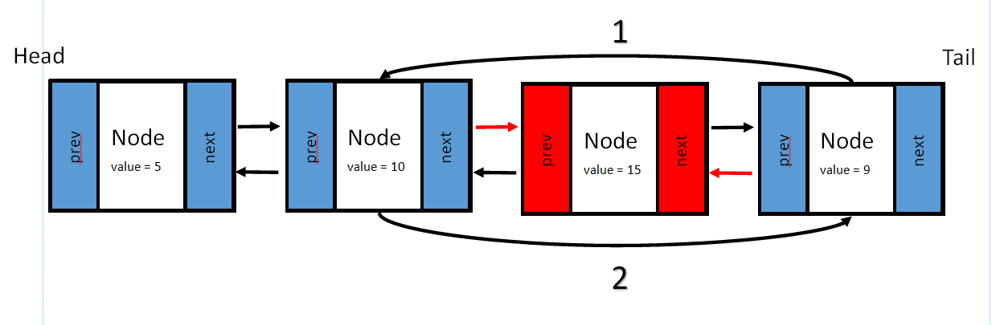

# Linked List

* [Introduction – What is a Linked List?](#introduction)
    * Structure
* [When to use Linked Lists?](#when-to-use-linked-lists)
* [Elements of Linked Lists](#elements-of-linked-lists)
    * Inserting 
    * Removing 
    * Accessing 
* [Performance](#performance)
* [Example](#example)
* [Problem to Solve](#problem-to-solve)

## Introduction
Previously in stacks and dynamic arrays we see that they are all *stored in memory right next to one another*. This make for quick access of items and this is the same for a queue, set, and map. A **Linked List** on the other hand is *stored in a random way in memory*. Each element is called a **Node**. Each node contains the address or pointer of the **next** node in the list. When using the same analogy as stacks, each scoop of ice cream will have the location of the next scoop of ice cream.

**Linked List**



The first node is know as the **Head**. Knowing where the head is allows you to navigate through the whole link list but following each pointer after the head. most linked lists look like the following figure of a doubly-linked list. This shows that Linked lists are mostly bi-directionally linked. Each node keeps track of the **Next** node and the **Previous** node. The **tail** of the linked list is similar to the head but references the last node in the linked-list.  

**Doubly-Linked List**




## When to use Linked Lists?

Linked lists are a good choice when there will be constant changes to the list. This data structure is good at allocating memory if more nodes are added instead of copying everything to create a new list for more room. Also you will be ale to insert where ever you need into the linked list.

## Elements of Linked Lists

|Operation          |Description                                            |Python Code                   |Preformance|
|------------       |-------------------------------------------------------|------------------------------|-----------|
|insert_head(item)  |Adds "item" before the head                            |icecream.appendleft(flavor)   |O(1)       |
|insert_tail(item)  |Adds "item" after the tail                             |icecream.append(flavor)       |O(1)       |
|insert(a, item)    |Adds "item" after node "a"                             |icecream.insert(a,flavor)     |O(n)       |
|remove_head()      |Removes the first node known as the head               |flavor = icecream.popleft()   |O(1)       |
|remove_tail()      |Removes the last node known as the tail                |flavor = icecream.pop()       |O(1)       |
|remove(a)          |Removes node "a"                                       |del icecream[a]               |O(n)       |
|size()             |Return the size of the linked list                     |numFlavors = len(icecream)    |O(1)       |
|empty()            |Returns true if the length of the linked list is empty |if len(icecream) == 0         |O(1)       |  

### Inserting 

**Insert the Head**


1. Create the new node.
1. Set the next pointer of the new node to the current head.
1. Set the previous pointer of the old head to the new node.
1. Set the head to the new node.

In a similar manner use this process to insert to the tail

**Insert in the Middle**


1. 
1. 
1. 
1. 
1. 

### Removing 

**Removing the Head**

1. 
1. 

**Removing in the middle**

1. Link the next node to the previous node - currentNode.next.prev = currentNode.prev
1. link the previous node to the next node - currentNode.prev.next = currentNode.next

### Accessing
When we need to traverse anything in a linked list we need to use a loop to check each node for the data that we are searching for. Starting at the head or tail we use the **next** when starting at the **head** (**prev** for starting at the **tail**). We look at the data in each node with each loop until we find the node that we are looking for.

```python
def traversing(list, lookingFor)

    # Start at the Head or Tail
    currentNode = list.head

    # Loop through the Linked-list (when the next or previous node is none)
    while currentNode is not None:

        # Check to see if the current node is what your looking for
        if currentNode.data == lookingFor:

            # Print the data of the current node
            print(currentNode.data)

        # Use the pointer of the current node to move forward (next) or backward (prev)
        currentNode = currentNode.next
```


## Performance

From the Table above we can see that Linked lists are great when we have to insert or remove from the head or the tail but once we have to search through the linked list for a particular node it becomes a O(n) operation. This is because we will have to loop through the Linked list to find the node that we want so depending on how large the list is then it will affect the performance in a like manner.

## Example

## Problem to Solve


[Overview](../README.md) | [Previous Lesson](../2-Stacks/Stacks.md) | [Next Lesson](../4-Trees/Trees.md)