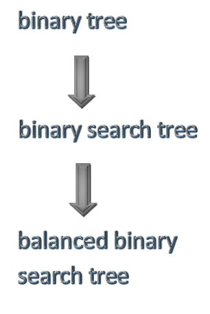
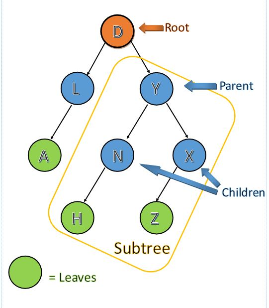

# Trees

* [Introduction – What is a Tree?](#introduction)
    * Structure
* [When to use a Tree?](#when-to-use-a-tree)
* [Elements of Linked Lists](#elements-of-trees)
    * Recursion
    * Binary Search Tree
    * Balanced Binary Search Tree
    * Inserting to a Binary Search Tree
    * Navigating a Binary Search Tree 
* [Performance](#performance)
* [Example](#example)
* [Problem to Solve](#problem-to-solve)

## Introduction
To start this lesson we will relate trees to our common theme of Ice cream. Imagine that you have many different flavor of Ice cream, and also you have to think about all the different combinations of topping that there are. Well when you use a tree(specifically a balanced binary search tree) that mess will turn into a very well organized system of as many flavors and conmination of topping that you could think of. Trees are very similar to linked list. The reason being that they both have nodes that are connected by pointers. The difference is that trees can connect to many different nodes. There are a few different trees but essentially they build upon one another. 



To start off lets in talking about a binary tree. A **binary tree** only links to two **nodes**. Each node has a bi-directional link as we saw in linked lists. The top node is refered to as the **root** of the tree (there is only one root node in a tree). Node that have connections to other nodes are called **parent** nodes. Nodes that are connected to a parent are known as **child** nodes. Nodes that do not have any children are known as **leaf** nodes. Each nodes, left and right of the parent node form **subtrees**. The following image showes all these different connections.



## When to use a Tree?
Some reasons that you might want to use a tree is when you need to store information into a hiarchy of data. for example the file system that you have in your computer. That file system of yours is basically your own personalized tree to keep all of your files as you see fit.

## Elements of Trees

|Operation          |Description                                            |Preformance|
|------------       |-------------------------------------------------------|-----------|
|insert(item)       |Adds "item" into the tree                              |O(Log n)   |
|remove(item)       |Adds "item" from the tree                              |O(Log n)   |
|contains(item)     |See if item is in the tree                             |O(Log n)   |
|traverse_forward() |Look at all objects from the largest to the smallest   |O(Log n)   |
|traverse_reverse() |Look at all objects from the smallest to the largest   |O(Log n)   |
|height(node)       |find the height of a node                              |O(Log n)   |
|size()             |Return the size of the binary search tree              |O(1)       |
|empty()            |Returns true if the root node is empty                 |O(1)       |  


### Recursion
In order to fully understand trees we need to talk about recursion. Recursion is where a functions calls itself. For example:

```python
 def ice_cream():
     print("You scream, I scream, We all scream for Ice cream!!")
     ice_cream() # this will call the same function 
```

Now with recursion there are rules that need to be followed so we dont have a infinate loop of a function calling itself. These two rules are:
1. **Base case** - this is the case in which we will stop the recursion calling
1. Making it **closer to the base case** with each recursion call.

Now lets use the same example as before with these rules

```python
def ice_cream(numFlavors):
    if numFlavors <= 0:  # Base case
        return 
    else:
        print("You scream, I scream, We all scream for Ice cream!!")
        ice_cream(numFlavors - 1) # getting closer to the base case 
```

### Binary Search Tree

This is where we can build on a binary tree with a binary search tree. With a binary search tree(BST) values that are less than the root go to the left and values that are greater than the root go to the right. This also happens in a similar manner with nodes other than the root.

### Balanced Binary Search Tree

Now to build on a BST with a balanced BST. Now this difference is all in the height of the subtrees. the height is counting the nodes from the leafs to the root. Using this method is the most efficient. 

### Inserting to a Binary Search Tree

### Navigating a Binary Search Tree

Using recursion this is a process of going to all nodes within a tree


## Performance
When we use a binary search tree to find a value we cut our work in half by cutting out a subtree. So with each recursive call work is cut in half to find what you are looking for or known as **O(log n)**. But the only reason that it can stay this way is if the binary search tree is ***balanced***. So without having the organization of a binary search tree it would be **O(n)** because each item would have to be looked through.

## Example

```python
class BST:

    class Node:
        
        # Each node of the BST will have data and links to the left and right sub-tree.

        def __init__(self, data):

            #Initialize the node to the data provided
       
            self.data = data
            self.left = None
            self.right = None

    def __init__(self):

        #Initialize an empty BST.
    
        self.root = None

    def insert(self, data):

        if self.root is None: # if there isnt anything in the tree set the root to the new node
            self.root = BST.Node(data)
        else:
            self._insert(data, self.root)  # Start at the root

    def _insert(self, data, node):
    
        if data == node.data:
            #print("already in list")
            pass
        elif data < node.data:
            # The data belongs on the left side.
            if node.left is None:
                # We found an empty spot
                node.left = BST.Node(data)
            else:
                # Need to keep looking.  Call _insert
                # recursively on the left sub-tree.
                self._insert(data, node.left)
        else:
            # The data belongs on the right side.
            if node.right is None:
                # We found an empty spot
                node.right = BST.Node(data)
            
            else:
                # Need to keep looking.  Call _insert
                # recursively on the right sub-tree.
                self._insert(data, node.right)
    
```

## Problem to Solve
Build on the example and Traverse a tree 

[Solution](trees.py)

## Resourses

CSE 212 Readings and Prove

[Applications of tree data structure](https://www.geeksforgeeks.org/applications-of-tree-data-structure/)


-------
[Overview](../README.md) | [Previous Lesson ](../3-LinkedList/LinkedList.md)